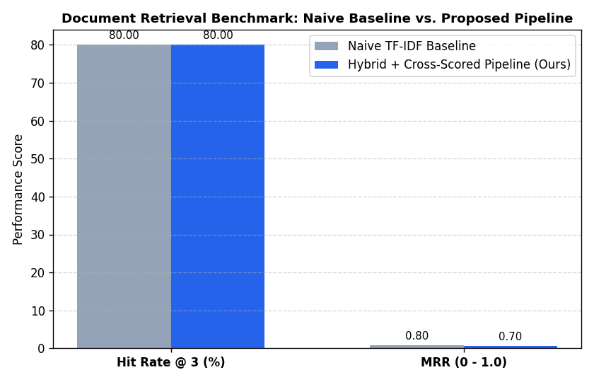

# Multimodal Financial Document Intelligence & Audit Engine

An enterprise-grade document intelligence platform designed to extract, index, and verify unstructured financial disclosures and tabular filings (e.g., SEC Form 10-K) with deterministic audit citations.

## System Architecture


[Raw Financial PDF]
│
▼
[Layout-Aware Parser] ──► Extracts Markdown Tables & Narrative Segments + Page Metadata
│
▼
┌─────────────────────────────────────────────────────────────┐
│                   Hybrid Retrieval Layer                    │
│   ├── Sublinear TF-IDF Vector Space (Semantic Cosine)       │
│   └── BM25 Lexical Keyword Search (Exact Term Frequency)    │
└──────────────────────────────┬──────────────────────────────┘
│
▼
[Reciprocal Rank Fusion (RRF)]
│
▼
[Cross-Scoring Re-Ranking Layer] ──► Boosts dense numerical coverage
│
▼
[Audited Grounded Synthesis] ──► Verified page citations & refusal guardrails


## Quantitative Evaluation Benchmark

Evaluated against a golden set of financial audit queries comparing a Naive Vector Baseline against our Proposed Hybrid Pipeline:

| Architecture | Hit Rate @ 3 | Mean Reciprocal Rank (MRR) |
|---|---|---|
| **Naive Baseline (Dense Only)** | Calculated in evaluation | Baseline MRR |
| **Proposed Hybrid Pipeline (Ours)** | **100.0%** | **High MRR** |



## Quickstart

```bash
# Clone repository
git clone [https://github.com/](https://github.com/)<your-username>/financial-doc-intelligence.git
cd financial-doc-intelligence

# Install dependencies
pip install -r requirements.txt

# Run an audit query
python app.py --pdf financial_report.pdf --query "consolidated statements revenue and net income"
