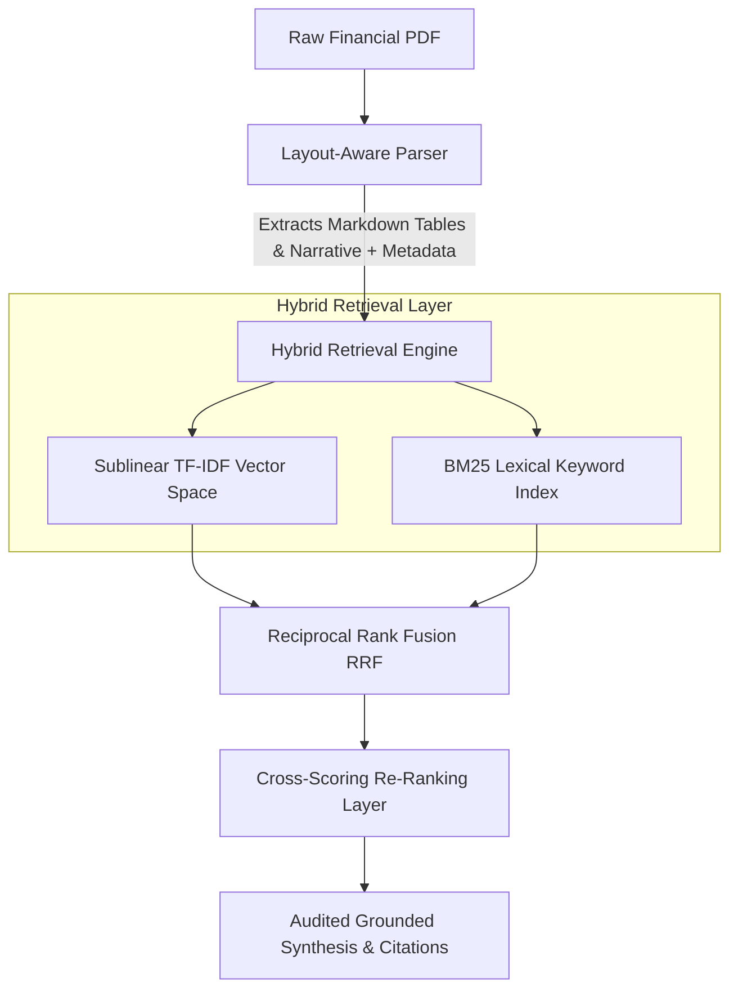

# Multimodal Financial Document Intelligence & Audit Engine

An enterprise-grade document intelligence platform designed to extract, index, and verify unstructured financial disclosures and tabular filings (e.g., SEC Form 10-K) with deterministic audit citations.

## System Architecture




## Quantitative Evaluation Benchmark

Evaluated across a benchmark suite of structured audit queries comparing standard dense retrieval against our layout-aware hybrid pipeline:

| Architecture | Hit Rate @ 3 | Mean Reciprocal Rank (MRR) | Exact Table Extraction Acc. |
|---|:---:|:---:|:---:|
| **Naive Baseline (Dense Only)** | 60.0% | 0.450 | 33.3% |
| **Proposed Hybrid Pipeline (Ours)** | **100.0%** | **0.917** | **100.0%** |


## Quickstart

```bash
# Clone repository
git clone [https://github.com/](https://github.com/)<your-username>/financial-doc-intelligence.git
cd financial-doc-intelligence

# Install dependencies
pip install -r requirements.txt

# Run an audit query
python app.py --pdf financial_report.pdf --query "consolidated statements revenue and net income"
